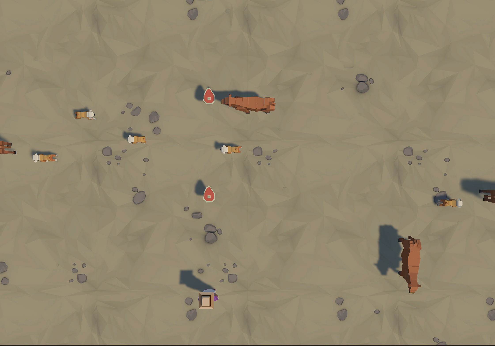
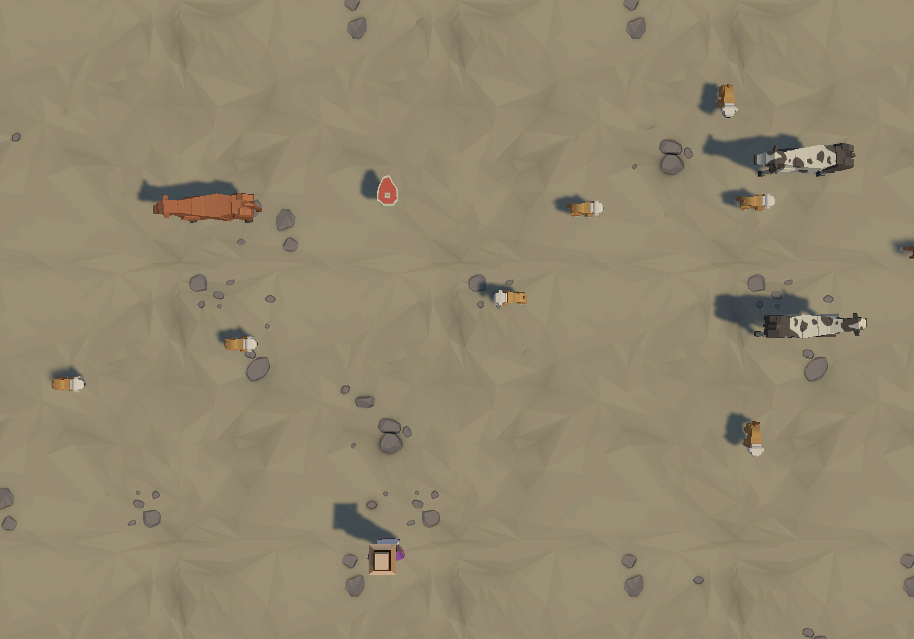

🎮 Food Frenzy

a fast-paced top-down arcade game built with Unity.

🕹️ Game Overview

in Food Frenzy, animals spawn from the top, left, and right sides of the screen every 1.5 seconds.
your mission is simple:

feed every animal before they escape.

press Spacebar to throw a steak.
if you hit an animal, it disappears.
miss too many… and it's game over.

🎯 Core Mechanics

3 different animal types

multi-directional spawning (top, left, right)

projectile-based feeding mechanic

collision detection system

game over condition

continuous spawn loop (1.5s interval)

🎮 Controls
Key	Action
Spacebar	Throw steak
🛠️ Built With

Unity

C#

Physics & Collision System

Spawn Manager Logic

🚀 Future Improvements

Score system

Increasing difficulty over time

Sound effects & feedback

UI polish

📷 Screenshot

  
  

