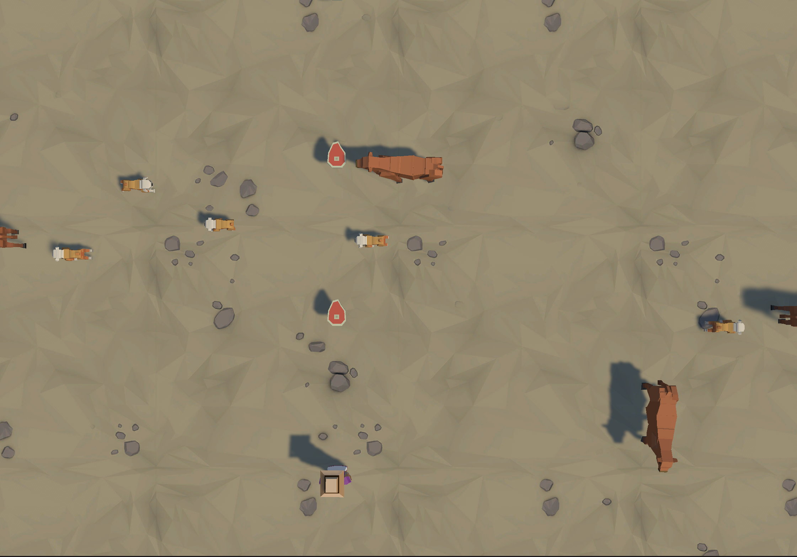
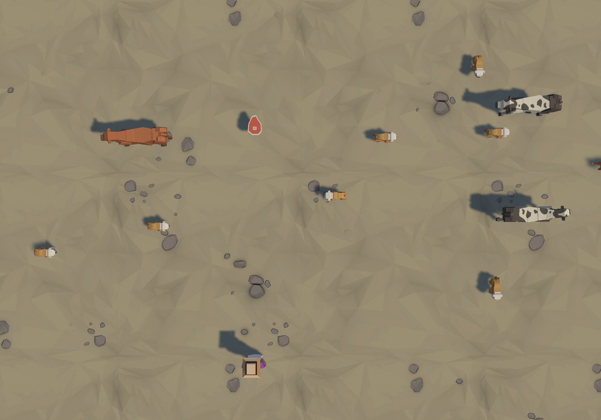

# 🎮 Food Frenzy

A fast-paced top-down arcade game built in Unity, made as part of Unity's **Junior Programmer** learning pathway.

## 🕹️ Overview

Animals spawn from the top, left, and right sides of the screen every 1.5 seconds, and it's up to you to feed them before they escape. Press **Spacebar** to throw a steak — hit an animal and it disappears, but let too many slip past and it's game over.

## 🎮 Controls

| Key | Action |
|-----|--------|
| Spacebar | Throw steak |

## 🎯 Features

- 3 different animal types
- Multi-directional spawning (top, left, right)
- Projectile-based feeding mechanic, launched via a reusable Prefab
- Collision detection system that destroys animals on hit
- Continuous timed spawn loop (1.5s interval)
- Game over condition when animals escape

## 🛠️ Built With

- Unity
- C#
- Physics & Collision System
- Spawn Manager Logic

## 📖 Project Background

This project was built by following Unity's **Junior Programmer** pathway, across four main stages:

1. **Player Movement & Setup** — creating the project, choosing the player character, animals, and food, and giving the player side-to-side movement constrained within bounds using if-then statements.
2. **Projectile Launching** — writing a script to launch the food projectile forward, converting it into a reusable Prefab with all its scripts and properties, letting the player fire it with Spacebar, and removing objects once they leave the screen.
3. **Animal Spawning** — creating a spawn manager to make animal prefabs appear on their own at random positions along the top of the screen.
4. **Timed Spawning & Game Over** — spawning animals on a timer, adding colliders so projectiles destroy animals on contact, and displaying a "Game Over" message when an animal escapes past the player.

## 📷 Screenshot

  
  

